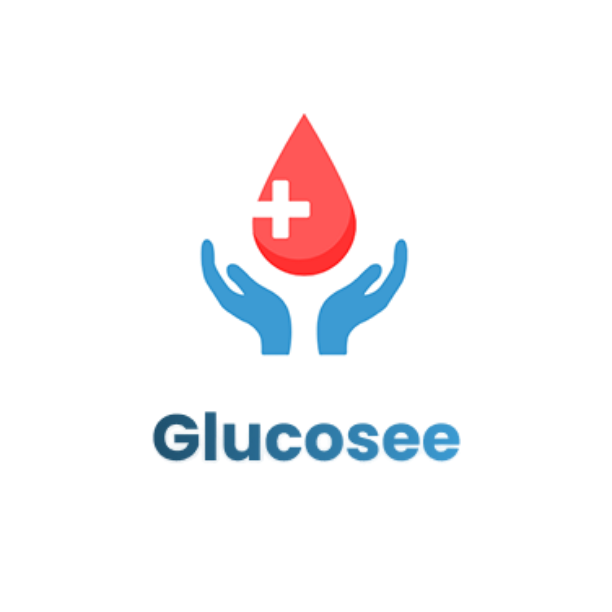

<div align="center">
  
  
  
  
  
  <br/>
  
  
</div>

<br/>

<p align="center">
  
</p>

<h1 align="center">Glucosee</h1>
<p align="center"><b>Smart Monitoring for Better Living</b></p>

<p align="center">
  Aplikasi monitoring gula darah untuk pasien diabetes yang terintegrasi dengan tenaga medis, keluarga, dan AI asisten kesehatan.
</p>

<p align="center">
  <a href="https://github.com/mayshacutes/glucosee/releases">
    
  </a>
  <a href="https://github.com/mayshacutes/glucosee/releases/latest">
    
  </a>
  <a href="LICENSE">
    
  </a>
</p>

---

## ✨ Fitur Utama

### 🩺 Untuk Pasien
| Fitur | Keterangan |
|-------|-----------|
| 📊 **Monitoring Gula Darah** | Catat & pantau kadar gula darah harian |
| 🤖 **AiGlo (AI Asisten)** | Tanya jawab seputar diabetes & kesehatan |
| 📅 **Appointment** | Booking jadwal konsultasi dengan tenaga medis |
| 💳 **Pembayaran** | BPJS (gratis) atau Mandiri (Rp 50.000) |
| 💬 **Chat dengan Nakes** | Konsultasi langsung via chat saat jam appointment |
| 👨‍👩‍👧 **Koneksi Keluarga** | Pantau kadar gula darah oleh anggota keluarga |
| 💊 **Pengingat Obat** | Notifikasi minum obat tepat waktu |
| 📰 **Artikel Edukasi** | Informasi kesehatan & diabetes |

### 🏥 Untuk Tenaga Medis
| Fitur | Keterangan |
|-------|-----------|
| 📋 **Jadwal Appointment** | Kelola & setujui permintaan konsultasi |
| 💬 **Chat dengan Pasien** | Konsultasi dalam masa 1x24 jam |
| 📝 **Resep Obat** | Buat resep digital untuk pasien |
| 📈 **Input Gula Darah** | Catat hasil pemeriksaan pasien |

### ⚙️ Untuk Admin
| Fitur | Keterangan |
|-------|-----------|
| 📊 **Dashboard** | Grafik & statistik pengguna |
| ✅ **Verifikasi Nakes** | Approve akun tenaga medis |
| 💰 **Verifikasi Pembayaran** | Konfirmasi pembayaran pasien |
| 📝 **Artikel** | Kelola artikel edukasi |

---

## 🚀 Download

[](https://github.com/mayshacutes/glucosee/releases/latest)

Atau kunjungi **[halaman release](https://github.com/mayshacutes/glucosee/releases)** untuk melihat semua versi.

---

## 🛠️ Tech Stack

<div align="center">

| Teknologi | Kegunaan |
|-----------|----------|
| [Flutter](https://flutter.dev) | Framework UI cross-platform |
| [Dart](https://dart.dev) | Bahasa pemrograman |
| [Supabase](https://supabase.com) | Backend (Auth, Database, Realtime) |
| [Groq API](https://groq.com) | AI chatbot (Llama 3.3 70B) |
| [flutter_dotenv](https://pub.dev/packages/flutter_dotenv) | Konfigurasi environment |
| [fl_chart](https://pub.dev/packages/fl_chart) | Grafik & chart |
| [Google Fonts](https://pub.dev/packages/google_fonts) | Font Poppins |
| [image_picker](https://pub.dev/packages/image_picker) | Upload bukti pembayaran |
| [flutter_local_notifications](https://pub.dev/packages/flutter_local_notifications) | Notifikasi pengingat obat |

</div>

---

## 🏗️ Arsitektur Aplikasi

```
glucosee/
├── lib/
│   ├── screens/
│   │   ├── auth/          # Login, Register, Splash
│   │   ├── patient/       # Pasien (Home, Chat, Appointment, AiGlo, Profile)
│   │   ├── medic/         # Nakes (Chat, Appointment, Resep, Profile)
│   │   └── admin/         # Admin (Dashboard, Users, Articles, Payments)
│   ├── services/          # Supabase, Auth, Patient, Medic services
│   ├── theme/             # AppTheme, colors
│   └── main.dart          # Entry point
├── android/
├── ios/
├── assets/
└── .env                   # API keys (GROQ, etc.)
```

---

## 🔧 Cara Menjalankan

### Prerequisites
- Flutter SDK >= 3.0.0
- Android Studio / VS Code
- Emulator atau device fisik

### Langkah-langkah

```bash
# 1. Clone repository
git clone https://github.com/mayshacutes/glucosee.git
cd glucosee

# 2. Install dependencies
flutter pub get

# 3. Setup environment
cp .env.example .env
# Edit .env, isi GROQ_API_KEY dengan key dari https://console.groq.com/keys

# 4. Jalankan aplikasi
flutter run
```

### Build APK

```bash
flutter build apk --release
```

Hasil build: `build/app/outputs/flutter-apk/app-release.apk`

---

## 📸 Screenshots

> *(Tambahkan screenshot aplikasi di sini)*

| | | |
|---|---|---|
| Home | Appointment | Chat |
| AiGlo AI | Profile | Admin Dashboard |

---

## 🤝 Kontribusi

Kontribusi selalu diterima! Silakan buat [issue](https://github.com/mayshacutes/glucosee/issues) atau pull request.

---

## 📄 Lisensi

Proyek ini dilisensikan di bawah **MIT License** - lihat file [LICENSE](LICENSE) untuk detail.

---

<p align="center">
  Dibuat dengan ❤️ untuk membantu penderita diabetes
</p>

<p align="center">
  <a href="https://github.com/mayshacutes/glucosee">
    
  </a>
  <a href="https://github.com/mayshacutes/glucosee/fork">
    
  </a>
</p>
